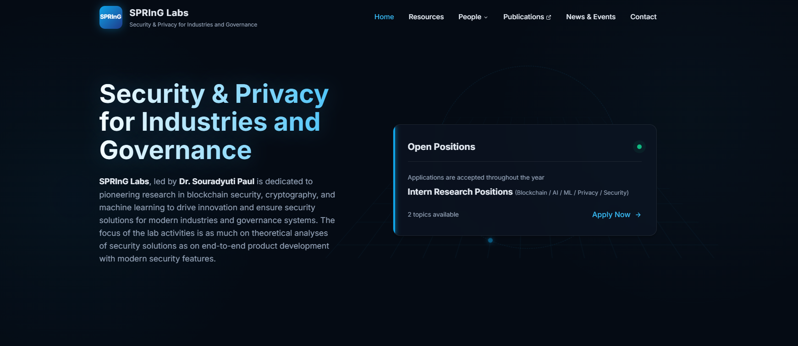
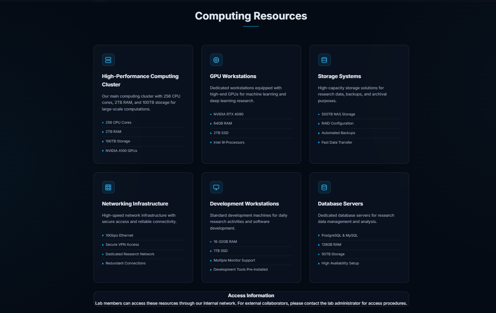
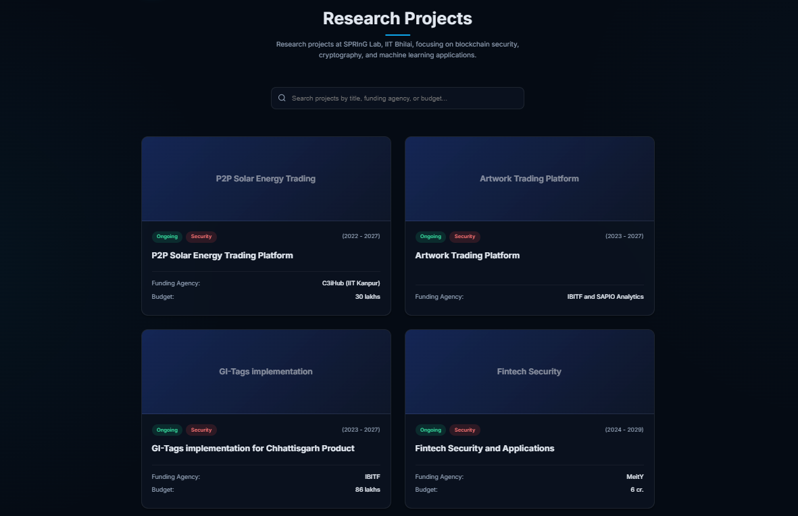

# SPRInG Labs Website Redesign

Welcome to the new, premium redesign of the **SPRInG Labs** (Security & Privacy for Industries and Governance) website. This project modernizes the lab's online presence with a sleek, high-tech dark theme, utilizing glassmorphism and subtle glowing accents to perfectly reflect a cutting-edge cybersecurity research environment.

## 🌟 Key Features

- **Premium Dark Theme**: A deep navy background (`#050b14`) paired with vibrant cyan and emerald accents for a true "cybersecurity" aesthetic.
- **Glassmorphism UI**: Frosted glass effects on cards and menus to provide depth and a modern feel.
- **Fully Responsive**: Adapts seamlessly to desktop, tablet, and mobile displays.
- **Interactive Elements**: 
  - Dynamic, sticky navigation bar with scroll effects.
  - Smooth hover animations on computing resources and project cards.
  - Functional search bar for filtering research projects.
- **Zero Dependencies**: Built with Vanilla HTML, CSS, and JavaScript for maximum performance and easy maintenance.

## 📸 Screenshots

Here is a look at the newly designed interface:

### Hero Section
*(Showcases the mission statement and the dynamic "Open Positions" card)*

### Computing Resources
*(A responsive grid highlighting the lab's hardware capabilities)*

### Research Projects
*(Interactive project cards with a search filter)*

> **Note:** To display these screenshots, simply create an `assets/` folder in the root directory and drop your images there, naming them `hero-section.png`, `computing-resources.png`, and `research-projects.png`.

## 🚀 Getting Started

Since this project uses vanilla web technologies, there is no build step or installation required!

1. Clone or download this repository.
2. Open `index.html` directly in your favorite web browser.
3. (Optional) To view changes with live reloading, you can use an extension like **Live Server** in VS Code.

## 🖼️ How to Add Your Own Images

The website includes pre-configured placeholder blocks for your lab's images. The CSS is designed to automatically crop and fit your images perfectly into the UI.

1. **Logo**: Open `index.html`, find the `
` (around line 17), and insert your `` tag inside it.
2. **Project Thumbnails**: Scroll down to the Research Projects section in `index.html`. Insert your `` tags inside the respective `
` blocks.

## 🛠️ Tech Stack

- **HTML5**: Semantic and accessible page structure.
- **CSS3**: Custom design system using CSS variables, Flexbox, CSS Grid, and modern backdrop-filters.
- **JavaScript (ES6)**: Lightweight DOM manipulation for the sticky header and search functionality.
